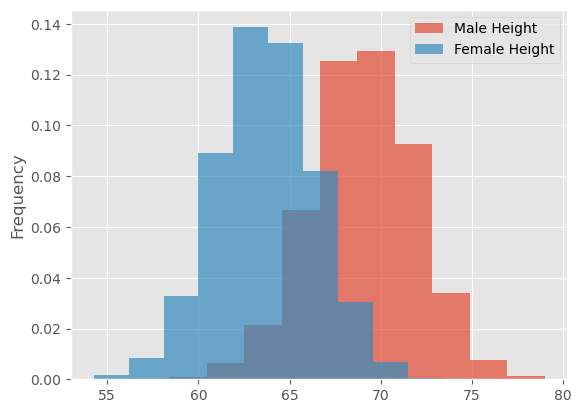
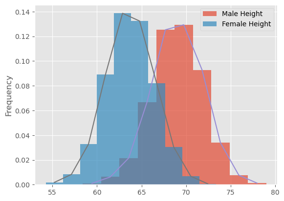

# The Probability Density Function - Lab

## Introduction
In this lab, we will look at building visualizations known as **density plots** to estimate the probability density for a given set of data. 

## Objectives

You will be able to:

* Calculate the PDF from a given dataset containing real-valued random variables
* Plot density functions and comment on the shape of the plot
* Plot density functions using seaborn

## Let's get started

Let's import the necessary libraries for this lab.


```python
# Import required libraries
import numpy as np
import matplotlib.pyplot as plt
plt.style.use('ggplot')
import pandas as pd 
```

## Import the data, and calculate the mean and the standard deviation

- Import the dataset 'weight-height.csv' as a pandas dataframe.

- Next, calculate the mean and standard deviation for weights and heights for men and women individually. You can simply use the pandas `.mean()` and `.std()` to do so.

**Hint**: Use your pandas dataframe subsetting skills like loc(), iloc() and groupby()


```python
data = None
male_df =  None
female_df =  None

# Male Height mean: 69.02634590621737
# Male Height sd: 2.8633622286606517
# Male Weight mean: 187.0206206581929
# Male Weight sd: 19.781154516763813
# Female Height mean: 63.708773603424916
# Female Height sd: 2.696284015765056
# Female Weight mean: 135.8600930074687
# Female Weight sd: 19.022467805319007
```

    Male Height mean: 69.02634590621737
    Male Height sd: 2.8633622286606517
    Male Weight mean: 187.0206206581929
    Male Weight sd: 19.781154516763813
    Female Height mean: 63.708773603424916
    Female Height sd: 2.696284015765056
    Female Weight mean: 135.8600930074687
    Female Weight sd: 19.022467805319007


## Plot histograms (with densities on the y-axis) for male and female heights 

- Make sure to create overlapping plots
- use binsize = 10, set alpha level so that overlap can be visualized


```python
# Your code here
```


```python
# Record your observations - are these inline with your personal observations?

```

## Create a density function using interpolation


- Write a densit function density() that uses interpolation and takes in a random variable
- Use`np.hist`
- The function should return two lists carrying x and y coordinates for plotting the density function


```python
def density(x):
    
    pass


# Generate test data and test the function - uncomment to run the test
# np.random.seed(5)
# mu, sigma = 0, 0.1 # mean and standard deviation
# s = np.random.normal(mu, sigma, 100)
# x,y = density(s)
# plt.plot(x,y, label = 'test')
# plt.legend()
```





## Add Overlapping density plots to the histograms plotted earlier


```python
# You code here 
```


## Repeat above exerice for male and female weights


```python
# Your code here 
```


## Write your observations in the cell below


```python
# Record your observations - are these inline with your personal observations?


# What is the takeaway when comparing male and female heights and weights?
```

## Repeat Above experiments in seaborn and compare with your results


```python
# Code for heights here
```





```python
# Code for weights here
```


```python
# Your comments on the two approaches here. 
# are they similar? what makes them different if they are?
```

## Summary

In this lesson you learned how to build the probability density curves visually for a given datasets, and compare the distributions visually by looking at the spread, center and overlap. This is a useful EDA technique and can be used to answer some initial questions before embarking on a complex analytics journey.
