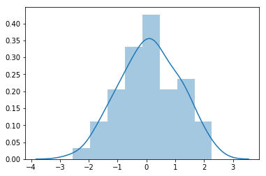
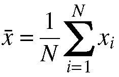
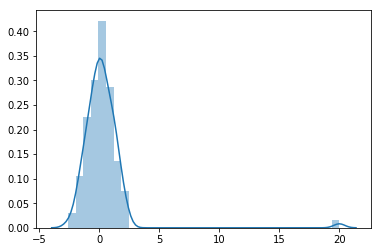

# Probability Density Functions Lab

## Problem Statement

In this lab, we'll learn how to use Probability Density Functions (PDFs) to explore our data set.  We'll also dive deep into calculating the mean, median, mode, and trimmed mean, and explore how each are influenced by outliers.  

### Objectives
* Compare and constrast the following Measures of Center: 
    * Mean
    * Median
    * Mode
    * Trimmed Mean
* Demonstrate the effect outlier values has on each
* Calculate each Measure of Center manually 
* Use numpy to calculate each Measure of Center

In the cell below, import `numpy` and alias it to `np`.  Also import `matplotlib.pyplot` as `plt`, and `norm` from `scipy.stats`.  Also set `%matplotlib inline`, and use `np.random.seed(0)` to set a random seed of 0 for reproducibility.   


```python
import numpy as np
import matplotlib.pyplot as plt
import scipy.stats
from scipy.stats import norm
import seaborn as sns
%matplotlib inline
# Set a seed for reproducibility--don't change it, or you'll break things!
np.random.seed(0)
```

We'll start by creating a synthetic dataset to work with.  This dataset will be normally distributed.   

In the cell below:

**1.** Use numpy's [`random.normal()`](https://docs.scipy.org/doc/numpy/reference/generated/numpy.random.normal.html) function to create a data set of `size=100`.    
<br>
**2.** Then, append the value `1.2` to our `data` array 5 times (we'll need this so that we can calculate a _mode_ later on).  Use the `np.append()` method and pass in the `data` variable, as well as an array containing `[1.2, 1.2, 1.2, 1.2, 1.2]`.  If you have trouble, take a look at the [documentation](https://docs.scipy.org/doc/numpy-1.14.0/reference/generated/numpy.append.html) for that method.  
<br>
**3.** Finally, use Seaborn's `sns.distplot()` method to visualize the probability density of this dataset.  


```python
data = np.random.normal(size=100)
data = np.append(data, [1.2, 1.2, 1.2, 1.2, 1.2])
sns.distplot(data)
```


    <matplotlib.axes._subplots.AxesSubplot at 0x2111aad1c88>





Great.  We'll want to plot it to make it visual, but before we can do that, we'll need to calculate some basic metrics such as the sample's **_mean_** and **_standard deviation_**. 

In the cell below, write a function that takes in `data` and returns the mean.

Recall that the formula for the mean is: 

<center></center>

where:


$\large \bar{x} = Sample\ Mean$

$\large N = Length\ of\ Dataset$

In the cell below, write a function that takes in an array of numbers and returns the mean of the data.  

Then, test that it works by using it on the `data` variable that we created above!


```python
def get_mean(data):
    # lazy way --> return np.sum(data) / len(data)
    accumulator = 0
    for i in data:
        accumulator += i
    
    return accumulator / len(data)

mean = get_mean(data)
print("Sample Mean: {:.6}".format(mean))
```

    Sample Mean: 0.114103
    

**Expected output:** Sample Mean: -0.059808

Great! Now that we have the mean, we just need to calculate the standard deviation. Our next lab is all about standard deviation and variance, so we'll leave the manual calculations for that lab and just use numpy for this one. 

Use the correct numpy function to calculate the standard deviation of `data` in the cell below. 


```python
std_dev = np.std(data)
print("Standard Deviation: {:.6}".format(std_dev))
```

    Standard Deviation: 1.01312
    

**Expected Output:** Standard Deviation: 1.00788

We'll go deeper into Standard Deviation and Variance in a later lab.  For now, it's just good to see what it is--we should never consider a mean value of a sample without also taking a look at the standard deviation!

### Calculating the Median

The median is the value directly in the middle of the a dataset--in statistical terms, this is the median quartile. If the dataset was sorted from lowest value to highest value, the median is the value that would be larger than the first 50% of the data, and smaller than the second 50%.  

If the dataset has an odd number of values, then the median is the middle number.   

If the datasaet has an even number of values, then we take the mean of the middle two numbers. 

In the cell below, write a function that takes in an array of numbers and returns the median value for that dataset.  


```python
def get_median(data):
    data = sorted(data)
    if len(data) % 2 == 0:
        val1_index = int((len(data) / 2) - 1)
        val2_index = val1_index + 1
        return (data[val1_index] + data[val2_index]) / 2
    else:
        med_index = (len(data) // 2) 
        return data[med_index]

test1 = [5, 4, 1, 3, 2]
test2 = [4, 2, 3, 1]

print(get_median(test1)) # 3
print(get_median(test2)) # 2.5
print(get_median(data)) # -0.19065349358139935
```

    3
    2.5
    0.12898291075741067
    

### Calculating the Mode

The mode is the value that shows up the most in a dataset.  A dataset can have 0 or more modes.  If no value shows up more than once, the dataset is considered to have no mode value.  If two numbers show up the same number of times, that dataset is considered **_bimodal_**.  Datasets where multiple values all show up the same number of times are considered **_multimodal_**.

In the cell below, write a function that takes in an array of numbers and returns another array containing the mode value(s).  

**_Hint_**: Building a histogram (also called a frequency distribution) with a dictionary is probably the easiest way to approach this problem!


```python
def get_mode(data):
    # Create and populate frequency distribution
    frequency_dict = {}
    for i in data:
        if i not in frequency_dict:
            frequency_dict[i] = 1
        else:
            frequency_dict[i] += 1
    
    # Create an array for mode values
    modes = []
    highest_freq = max(frequency_dict.values())
    for key, val in frequency_dict.items():
        if val == highest_freq:
            modes.append(key)
    
    return modes

test1 = [1, 2, 3, 5, 5, 4]
test2 = [1, 1, 1, 2, 3, 4, 5, 5, 5]
print(get_mode(test1)) # [5]
print(get_mode(test2)) # [1, 5]
print(get_mode(data)) # [1.2]
```

    [5]
    [1, 5]
    [1.2]
    

### How Outliers Affect Mean, Median, and Mode

The dataset that we created for this lab is fairly normally distributed, and doesn't contain any outliers. However, in the real world, we rarely have the luxury of working with outlier-free datasets.  In the cell below, we're going to write a function that helps us measure how much the mean, median, and mode are affected by outlier values.  

Write a function that takes in an array of numbers and an outlier value.  This function should calculate the mean, median, and mode values for the dataset, add the outlier to the dataset, and then recalculate the mean, median and mode values.  This function should return the amount the mean, median, and mode values were skewed by the outlier value (in that order).

**_Bonus_**: In the function, after adding in our outlier value, visualize the new distribution of the data as we did up above so we can see how the outlier has skewed the distribution.  


```python
def check_outlier_effect(data, outlier):
    mean_val = get_mean(data)
    median_val = get_median(data) 
    mode_val = get_mode(data)[0]
    
    data = list(data)
    data.append(outlier)
    
    skewed_mean = get_mean(data)
    skewed_median = get_median(data)
    skewed_mode = get_mode(data)[0]
    
    mean_effect = abs(mean_val - skewed_mean)
    median_effect = abs(median_val - skewed_median)
    mode_effect = abs(mode_val - skewed_mode)
    
    sns.distplot(data)
    return mean_effect, median_effect, mode_effect
    

mean_effect, median_effect, mode_effect = check_outlier_effect(data, 20)
print("Effect outlier had on mean: {}".format(mean_effect))
print("Effect outlier had on median: {}".format(median_effect))
print("Effect outlier had on mode: {}".format(mode_effect))
```

    Effect outlier had on mean: 0.1876028030949283
    Effect outlier had on median: 0.007530330201733659
    Effect outlier had on mode: 0.0
    





**_Expected Output:_**

```Effect outlier had on mean: 0.1876028030949283
Effect outlier had on median: 0.007530330201733659
Effect outlier had on mode: 0.0```

As we can see from the output:

* The mean is heavily influenced by outliers.
* The median is only slightly influenced by outliers.
* The mode is not influenced by outliers at all!

### Dealing with Outliers: Calculating the Trimmed Mean

One way to make use of the mean while protecting from outliers it to calculate the **_Trimmed Mean_**.  The trimmed mean avoids being influenced by outlier values by cutting off pre-set amounts from the low and high ends of the data distribution.  For instance, if we wanted to calculate the Trimmed mean of 5%, we would drop the 5% lowest values and 5% highest values, and then calculate the mean of the remaining data.  This is a great way to protect ourselves from outlier values when we need to make use of the mean on datasets that contain many outliers.  Note that the `trim` value is a parameter we can choose--if our dataset is particularly noisy, we may choose to trim 10% or 15%.  

In the cell below, write a function that takes in an array of data and calculates the trimmed mean, with a default value of 5%. 


```python
def get_trimmed_mean(data, trim=.05):
    lower_bound = int(np.round(len(data) * trim))
    upper_bound = int(np.round(len(data) * (1 - trim)))
    
    data = data[lower_bound:upper_bound]
    return get_mean(data)

trimmed_mean_test = [-10, 1, 1, 2, 3, 4, 5, 5, 6, 20] # trim = .10
print(get_trimmed_mean(trimmed_mean_test, .10)) # 3.375
print(get_trimmed_mean(data)) # -0.013374707098353195
```

    3.375
    -0.013374707098353195
    

### Conclusion
In this lab, we learned:
* How to calculate the mean, and how it is used
* How to calculate the median, and how it is used
* How to calculate the mode, and how it is used
* How to calculate the trimmed mean, and why it is more resistant to outliers  
